# ReFood: Personalized Food Recommendation Platform  

**ReFood** is a web application designed to help users make healthier food choices based on their medical conditions and dietary preferences. The platform provides personalized meal recommendations, allowing users to maintain their health while enjoying a variety of delicious and suitable meals.  

---

## Features  

- **Attractive and Responsive Design:** The user interface is fully responsive and adapts to all devices and screen sizes.  
- **User Profiles:**  
  - Create a personalized profile with medical conditions, allergies, and dietary preferences.  
  - Update health goals and preferences anytime.  
- **Personalized Recommendations:**  
  - Tailored meal and ingredient suggestions based on user health needs.  
  - Highlight foods to avoid based on allergies or conditions.  
- **Food Database:**  
  - A rich library of foods categorized by nutritional values and health benefits.  
  - Easy search for specific ingredients or meals.    
- **Admin Dashboard:**  
  - Manage the food database, add new categories, and update nutritional information.  
  - Monitor and respond to user feedback.  

---

## Technologies Used  

- **Frontend:** HTML, CSS, JavaScript, Bootstrap  
- **Backend:** C#, ASP.NET Core, Entity Framework  
- **Database:** SQL Server  
- **Version Control:** Git  

---

## Screenshots  

### User Interface  

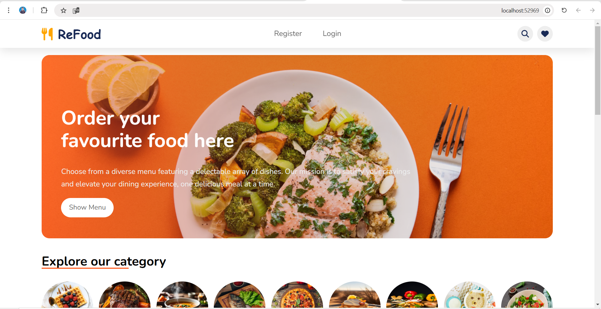  
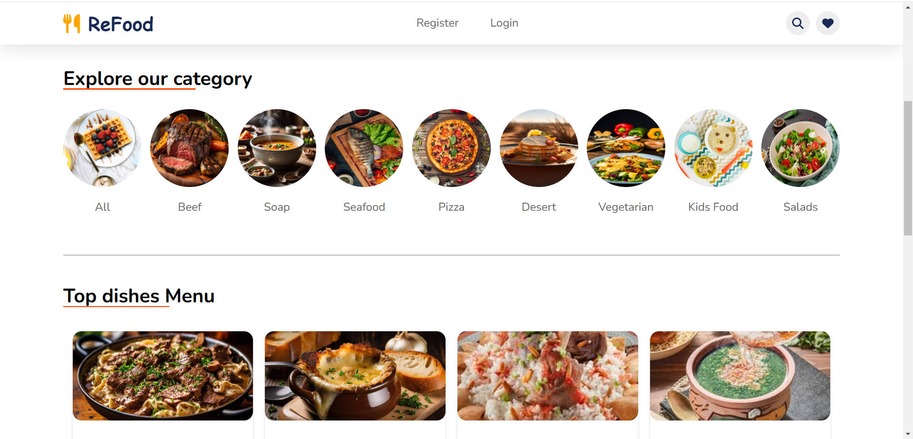  
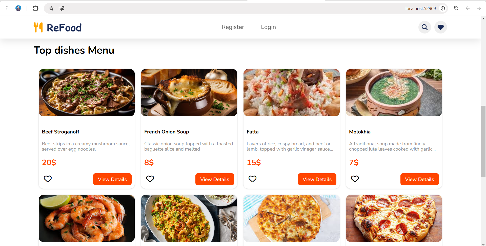  
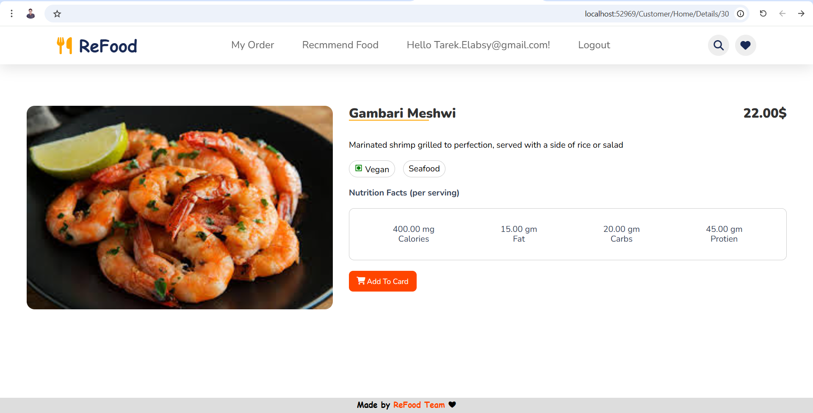 
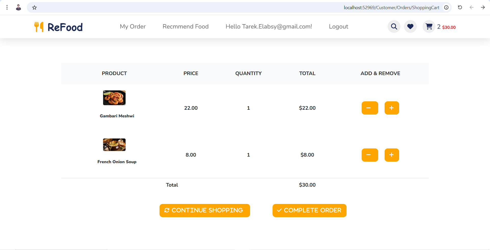
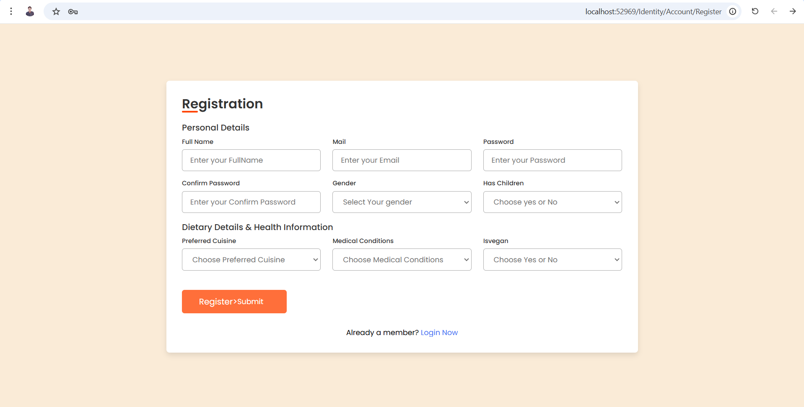
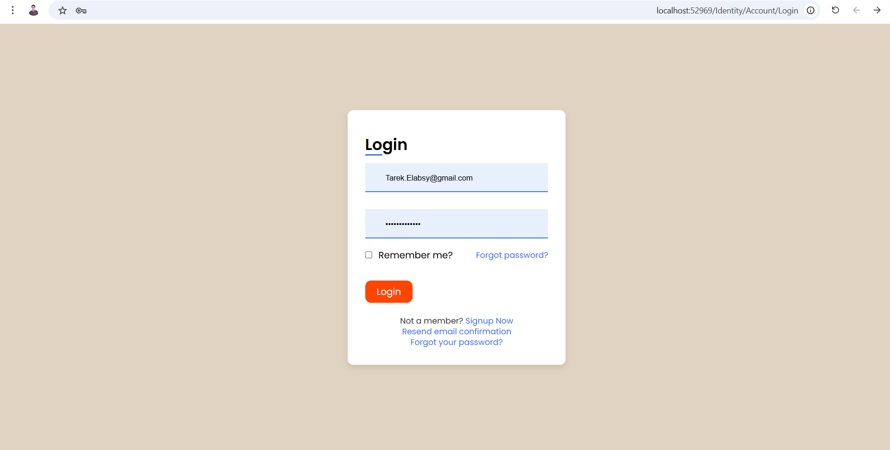 

### Admin Dashboard  

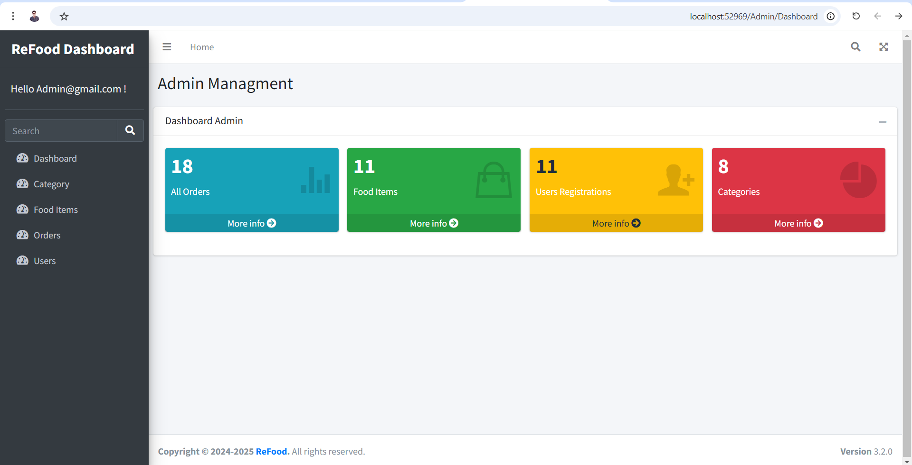
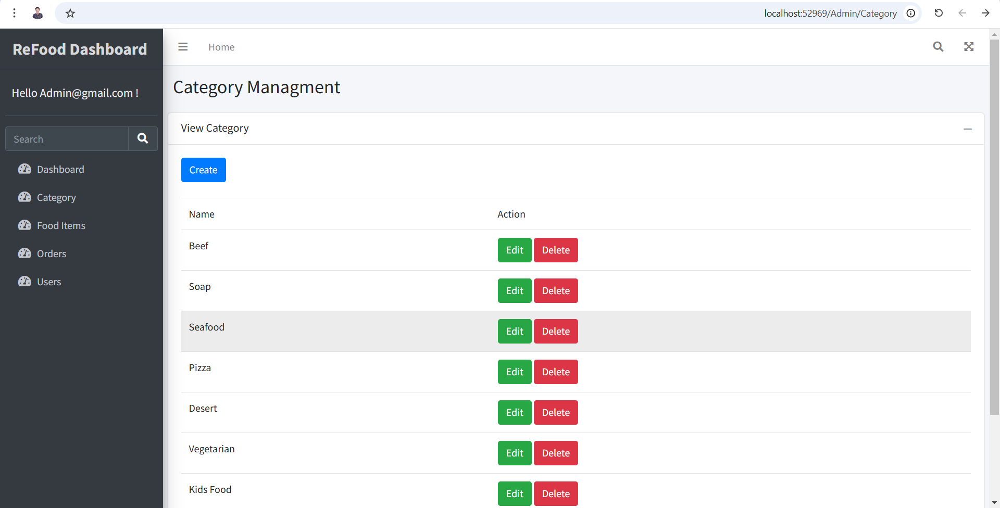
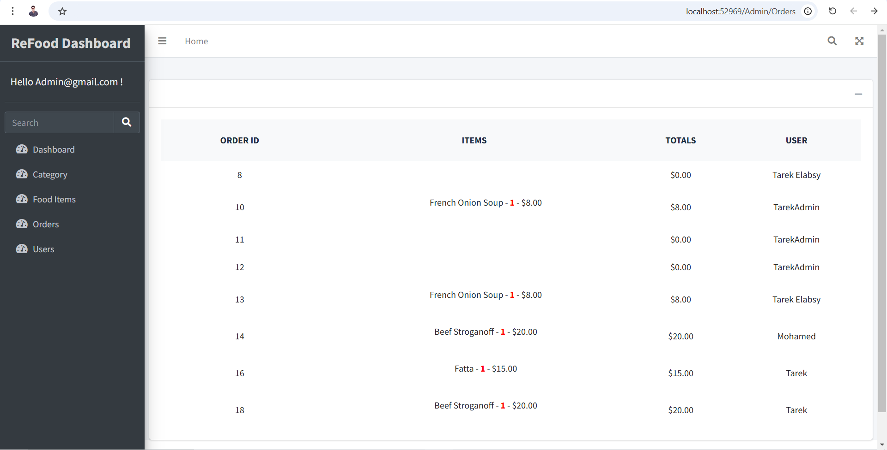
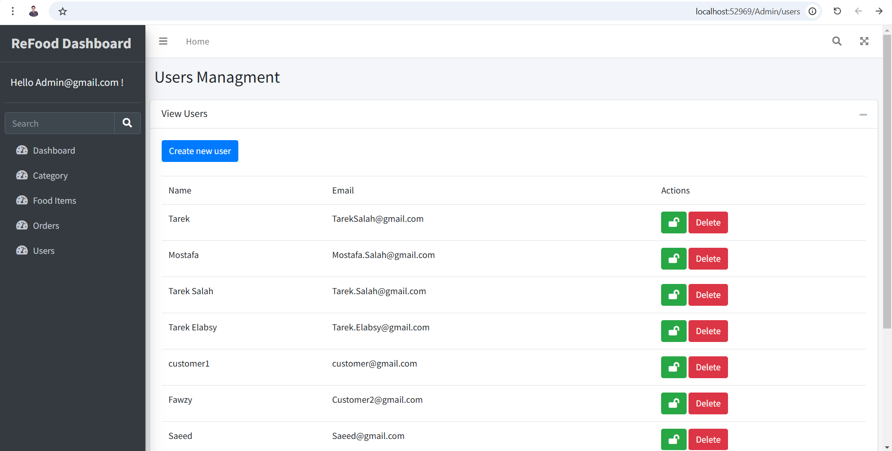

---

## Contact  

For any inquiries or collaborations, please connect with me on [LinkedIn](https://www.linkedin.com/in/tarek-elabsy222).  
